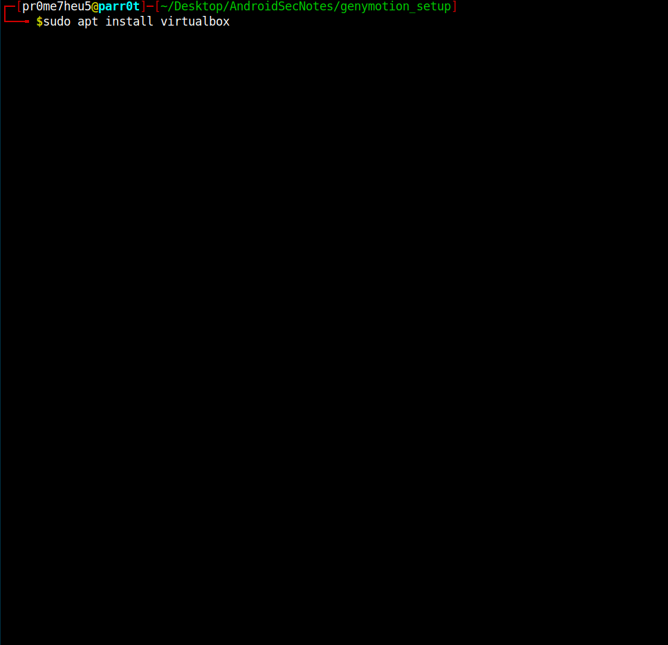
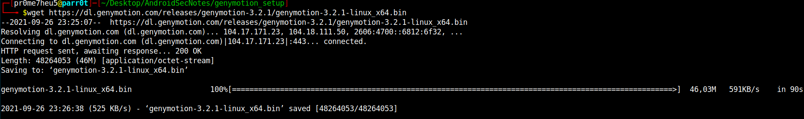
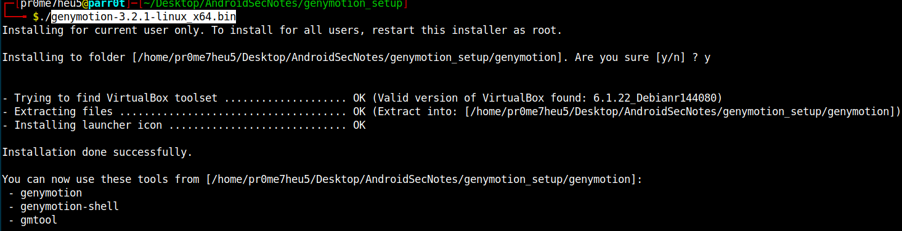
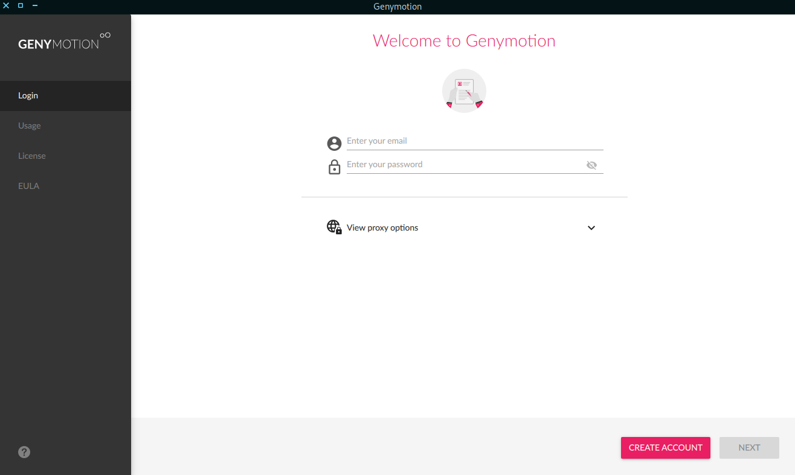
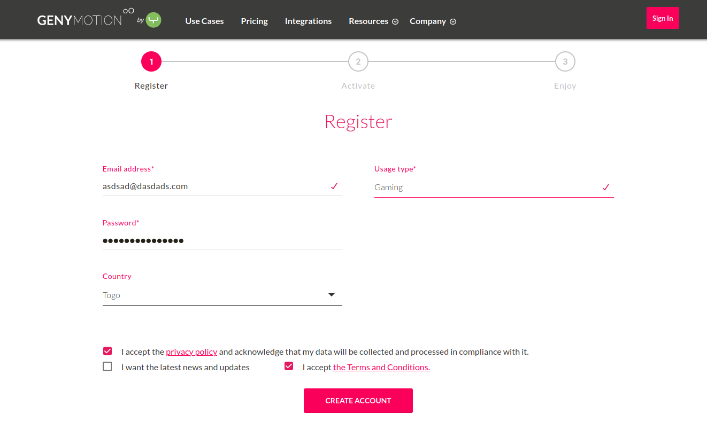
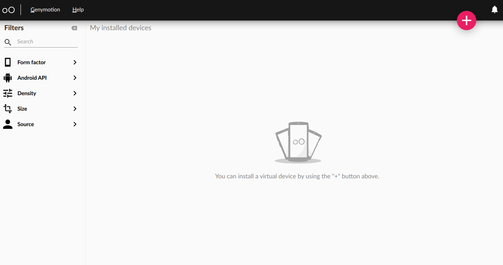

# Genymotion Setup and Installation

- ```First things first you need to install VirtualBox.```<br><br>
```sudo apt install virtualbox```<br><br>


- ```Download latest genymotion linux binary.```<br><br>
```wget https://dl.genymotion.com/releases/genymotion-3.2.1/genymotion-3.2.1-linux_x64.bin```<br><br>


- ```Give execution permission to downloaded binary.```<br><br>
```chmod +x genymotion-3.2.1-linux_x64.bin```<br><br>

- ```Run the binary and say 'y' to question.```<br><br>
```./genymotion-3.2.1-linux_x64.bin```<br>


- ```Install Genymotion to your system.```<br><br>
```sudo cp -r genymotion/ /opt/ && sudo ln -sf /opt/genymotion/genymotion /usr/bin/```<br><br>

- ```Create an account to use Genymotion.```<br>



- ```Now you ready to go :).```<br>
